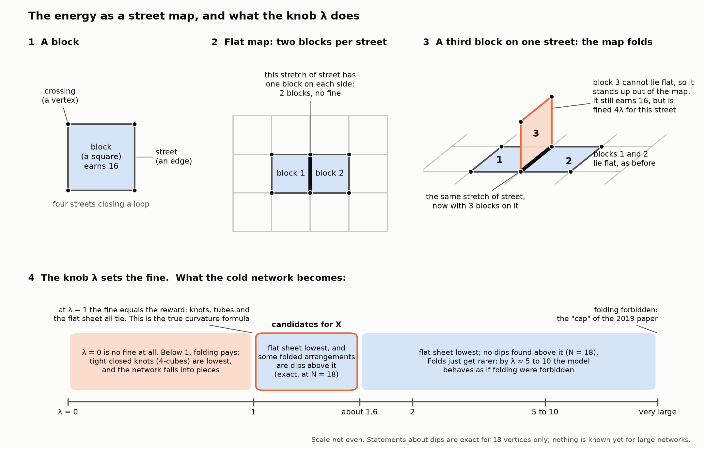
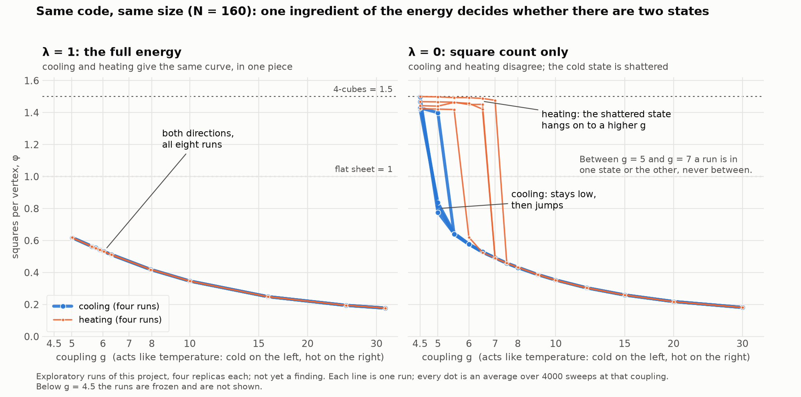
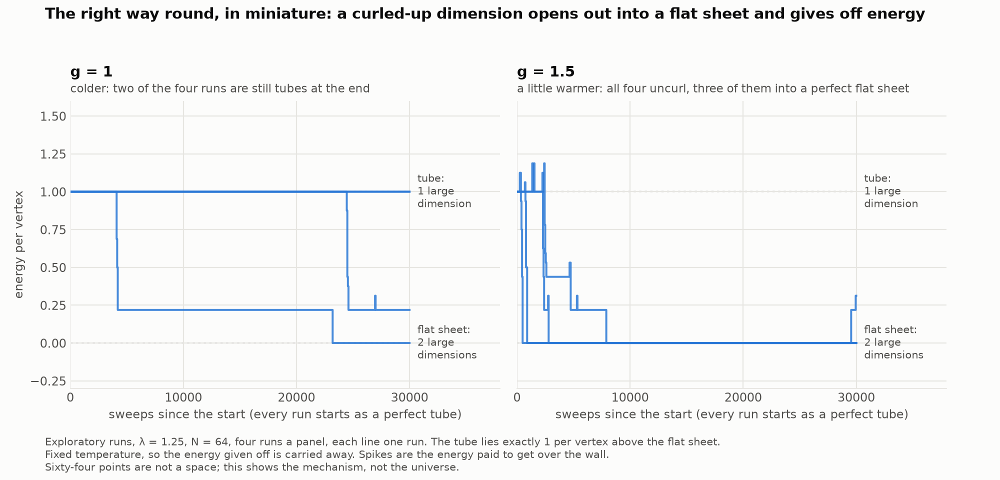

# Where does "where" come from?

*A plain-language introduction. Draft 3 (2026-09-20). It describes an idea, how we are testing it, and where the work stands today. Nothing in it is a finding yet: every run described here is exploratory, and no physicist has reviewed any of it.*

*What changed from Draft 2: the page now says where things stand. It adds the author's two refinements of her picture (cooling is a fine trigger as long as a threshold is crossed; the first move costs energy and the rest pays back more), a picture of the model as a street map, what has and has not been reproduced, and the first steps towards designing a model of our own. Draft 1's question, about contact lists, stays parked near the end.*

## The stage nobody questions

Almost every picture of the universe starts with a stage. Things happen *somewhere*. One place is near another place and far from a third. Even Einstein's general relativity, which lets the stage bend and stretch, still begins with a stage: space and time are the raw material, and physics describes what they do.

The standard history of the universe is told on that stage. About 13.8 billion years ago space was hot and dense, it expanded, and it cooled. Most cosmologists add an earlier chapter called inflation, a burst of extremely fast expansion that smoothed everything out. That story is well supported by evidence and nothing in this project disputes it.

What the standard story leaves alone is the stage itself. Why is there such a thing as "near" and "far" at all?

## A different starting point

A number of physicists take seriously the idea that space is not a basic ingredient. It may be something that *forms*, the way ice forms from water. This is a research direction, not an accepted fact, and nobody has made it work completely. Our project sits inside one small, concrete corner of it.

## The simplest published picture

Imagine a very large crowd of people, each holding a phone. At the start anyone can call anyone. There is no such thing as a neighbour, because everybody is one call away from everybody else. Asking "how far apart are these two people?" has no useful answer. In this picture the world before space has lots of relationships and no geometry.

Now suppose calls cost effort, and small closed loops of friends (you call her, she calls him, he calls you) are rewarding. As the crowd calms down, people keep only a few contacts, and the rewarding loops knit together into something like a net. In the net, some people are two steps away and others are two hundred. Distance has appeared. Nobody put it in. It came from the pattern of who is connected to whom.

The physicists who proposed this kind of model in 2006 gave the moment of knitting-together a name: **geometrogenesis**, the birth of geometry. In this picture the Big Bang is less like an explosion in space and more like a change of state, as when steam becomes water.

This simplest version has a difficulty that its own authors found. With ten thousand guests who may each talk to *anyone*, the number of messy arrangements explodes far faster than the crowd grows, and disorder wins by sheer weight of numbers. In the model, the bigger the universe, the colder it must get before space can form, and for an endlessly large universe it never forms at all. Remedies have been suggested, each with a cost.

## The picture this project starts from

The author's picture of the "before" is different, and the difference is the point of the project. We call the "before" **X**.

X is not a free-for-all. Think of a club with rules, not an endless crowd: a fixed number of members; each may make only so many calls a day; only so many of those may be repeat calls; an unanswered call costs more than a completed call earns, so everyone answers. Under rules like these there is a best way to arrange the calls, and the club settles into it. That settled arrangement is X. It is specific and stable. It may well have a shape of its own, its own kind of near and far, perhaps with a different number of dimensions from ours. The ingredients need not be endless, and they need not be free. They can stretch, combine or collapse, and each such change alters what is best for all the others.

Then a threshold is crossed and the arrangement gives way. The club reorganises into a new arrangement that is more stable than the old one, energy is released as it does so, and the new arrangement is the geometric spacetime we live in.

Three everyday comparisons carry most of the idea.

- **A chemical reaction.** Something that is stable for now, but not the most stable thing available, rearranges into something more stable and gives off energy.
- **A match and a bonfire.** The first step *costs* energy; the steps after it give back far more. A state like that sits in a dip with a wall round it. It stays put until something carries it over the wall.
- **Supercooled water.** Cooling is a perfectly good trigger. Very clean water can be taken below freezing and stay liquid: ice is already the more stable state, but the water sits in its dip. Tap the bottle and it freezes at once and gives off heat. And it does not all freeze: the heat released warms what is left, so you get slush that is warmer than the water you started with. In the author's picture, that leftover is part of the story: what did not convert remained, hotter.

This is a hobbyist's hypothesis. No physicist has reviewed it. It is written out, claim by claim, in `VISION.md`.

## The part that can be checked

Changes of state come in two kinds. Some are abrupt, like water freezing: the two states are distinct, and a definite lump of energy is given off at the changeover. Others are gradual, like butter softening: no sharp moment, no lump of energy.

The hypothesis needs the abrupt kind, because the lump of energy is its candidate for where matter and radiation came from. If the change that forms geometry turns out to be gradual in every model where it can be measured, that part of the hypothesis has nowhere to live.

We have not built a model of X. We start with a published model by Carlo Trugenberger and colleagues, in which the energy is a network version of the quantity that general relativity is built on. Its published results say the change is gradual in the full model, and abrupt in a simplified one, where the network breaks into small closed pieces instead of forming a space. Our first job is to reproduce those published results. Only then do we ask our question: which ingredients of the energy make the change abrupt, which make it gradual, and can any setting give an abrupt change *and* a connected space?

One limitation is stated up front. In that model the "before" is a random network, which is a closer relative of the free-for-all than of the club with rules. So it can tell us whether geometry can form abruptly out of randomness. It cannot, as it stands, tell us whether a rule-bound X would do so.

## The model as a street map

Think of the network as a street map. A **block** is four streets closing a loop, and the energy pays for every block, so the network wants as many as it can get. On a flat map every stretch of street has exactly two blocks beside it, one on each side. A third block on the same stretch cannot lie flat: the map has to fold over on itself there.

The model has one knob, called λ (lambda), and **λ is the fine for that folding.**

- With **no fine** (λ = 0) blocks get crammed in everywhere. The map folds into tight closed knots and falls into pieces. Published: the change is abrupt, but there is no space at the end of it.
- With the fine **equal to the reward** (λ = 1) the energy is the true curvature formula, the one tied to general relativity. Published: a connected space forms, but the change is gradual.
- With a **larger fine** the flat map wins more and more clearly, and with a very large one folding is simply forbidden.

The hypothesis needs abrupt *and* a space. The published results have one at each end of the knob, and neither end has both. So the knob is where we look.

## Where things stand (20 September 2026)

Everything below comes from runs labelled exploratory. The details, with every assumption and its source, are in `ASSUMPTIONS.md`.

**Reproduced.**

- With the full energy, our curve of "blocks per crossing against temperature" matches the curve published in 2019 for a network of 160 points, to about half a per cent wherever our runs settle down.
- Two published "sudden freeze" experiments behave as published: with no fine the network shoots past the flat value and shatters; with the full energy it stops at the flat value and stays in one piece.
- With no fine, we see what is published for that case, and the author has accepted it as passing the project's first reproduction gate: on cooling the network jumps from one state to another; on heating it hangs on to the cold state well past the point where it jumped; in between, a run is in one state or the other and never in the middle. The cold state is shattered, not a space.

**Not reproduced.** One figure in a 2025 review shows a sharp jump for the full energy at the same size. Neither version of the model we can build produces it, and it disagrees with the 2019 figure for the same system. That is a question for the authors. A short note to them is drafted and will be sent once the reproduction stage is finished. Until it is settled, the second reproduction gate stays open.

**Checked against exact answers.** For the smallest networks (14, 16 and 18 points) every possible arrangement has been listed, about 1.8 trillion of them at 18 points. The moves our simulation uses can reach all of them, and its averages agree with the exact ones to about three parts in ten thousand. For larger networks nobody, including the original authors, has shown that the moves reach everything.

**A small observation of our own.** The shattered pieces are described in the literature as four-dimensional cubes. There is a second kind, a 14-point piece with exactly the same energy per point, and it turns up by itself in about one finished piece in seven.

**What this says about the hypothesis so far.** Two distinct states with a lump of energy between them do occur in this family of models, which shows the mechanism is possible. But so far they occur only where no space forms. Where a space forms, the sizes we have run show no sign of an abrupt change. That is not yet a verdict: at these sizes a weak abrupt change and a gradual one look alike, and telling them apart needs larger networks and a sharper measurement, which is the next big piece of work.

## Towards a model of our own

The author's real goal is a designed model: one set of ingredients in a specific arrangement that turns into a less symmetrical, space-like one. A design brief (`docs/design/model_x_brief.md`) now lists what such a model must do and which factors decide how two phases relate. Three exact facts from the smallest networks point the way.

- **Dimension, in this model, is a simple count.** A crossing has four streets, which make six pairs. A pair that closes no block is a direction that stays large. The flat sheet has two large dimensions; curl one side of it up tightly and one remains; curl both and none does, which is the closed knot. So "a dimension collapses and loops in" is already something this model does, and the energy rewards it.
- **Below λ = 1 the model has the author's mechanism, wired backwards.** The flat sheet and the knots both sit in dips, and the knots are the lower one. The state that is stable for now and would convert with a release of energy is the *space-like* one.
- **Just above λ = 1 it has it the right way round, in miniature.** At 18 points, for λ between 1 and about 1.6, there are specific folded arrangements sitting in dips *above* the flat one: stable for now, higher in energy, with a wall to get over. Above about 1.6 there are none, and the model simply fades into the one where folding is forbidden.

Eighteen points are not a space, and the walls are low. That told us where on the knob to look at sizes we can simulate. Looking there gave the first result in this project that points towards the hypothesis.

**It has now been seen to happen, at toy size** *(added later on 20 September 2026; exploratory, four runs each)*. At λ = 1.25 we start a network of 64 or 96 points as a perfect tube: one large dimension, and exactly 1 unit of energy per point above the flat sheet. At low temperature it just sits there, for thousands of steps; in the coldest runs half of them outlast the whole run. Then, within a few hundred steps, it opens out into one connected, perfectly flat sheet with two large dimensions, and the energy it gives off is exactly the 1 per point known in advance.

That is the shape of the author's claim in miniature: something specific and stable for now, a threshold, an abrupt rearrangement, a definite amount of energy given off, and a flat, connected, space-like arrangement at the end, with more large dimensions than it started with. What it is not: sixty-four points are not a space; nothing is yet known about how this behaves as the network grows, which is what decides whether it is a true abrupt change of state; the tube is long-lived but some moves out of it cost nothing, so it is not strictly walled in; nothing says how a tube would come to be there; and at a fixed temperature the energy given off is simply carried away. At λ = 1.5 the tube does not last at all, in line with the exact result at 18 points. We also ran it the other way round as a rehearsal: below λ = 1 a perfect flat sheet waits, then drops in steps that land on exactly predicted energies, the first step being one dimension curling up.

## What comes next

1. The same experiment at larger sizes with more runs, and how the waiting time depends on temperature: is there a real wall, and how high?
2. Cooling from a random start at λ = 1.25, using the new sampling method for cold networks (now built and checked against exact answers): does cooling alone ever land in a tube?
3. Sealed and leaky runs, in which released energy stays inside the system, or escapes only slowly, as in the bottle of supercooled water. Every run so far has been at a fixed temperature, where released energy is simply carried away.
4. The sharper measurement of whether a change is abrupt, first at the two published ends of the knob and then along it.
5. Finishing the reproduction stage, and the note to the authors.

## An earlier version of the question (parked)

Draft 1 of this page asked something else: what if each person's phone only ever held a short contact list? We expected random short lists to tame the mess but leave nothing to knit with, and lists with local pattern to let the net form at an ordinary temperature however large the crowd. If so, **you cannot get geometry from nothing; you can get it from a richer, more tangled geometry that settles into a simpler one.** That is an expectation from an argument, never simulated by us, and the study is parked (`docs/parked/`). Its spirit carries over: the "before" has structure.

## What this is and is not

This is a toy model on a computer, with a few hundred points at most so far. It does not contain time as we experience it, or quantum behaviour, or matter. It cannot tell us whether the real universe began this way. What it can do is show whether a mechanism is possible or impossible inside a family of models, in a setting small enough that anyone can rerun every number.

That is why all of the code, every assumption and its source, and the predictions written down *before* the runs that test them are published alongside this text. Results that go against the hypothesis are reported as prominently as results that favour it.

---

*Sources. The hypothesis, claim by claim, with its published ancestors: `VISION.md`. Every assumption, every run described above and how far each has been checked: `ASSUMPTIONS.md`; the task list and the two reproduction gates: `TASKS.md`; bibliography: `REFERENCES.bib`. "Geometrogenesis" and the phone-network-like model: Konopka, Markopoulou and Smolin (2006). The disorder problem and the suggested remedies: Konopka (2008); Chen and Plotkin (2013). The model now used and its published results: Kelly, Trugenberger and Biancalana (2019); Trugenberger (2025). The contact-list argument: `ASSUMPTIONS.md` B1–B5, C1–C4. Age of the universe: Planck Collaboration 2018 results, still to be added to the bibliography. The figures are made by `scripts/plot_lambda_street_map.py` and `scripts/plot_cool_heat.py`. The club-with-rules analogy and the supercooled-water reading of it are the author's, tidied by the assistant.*
